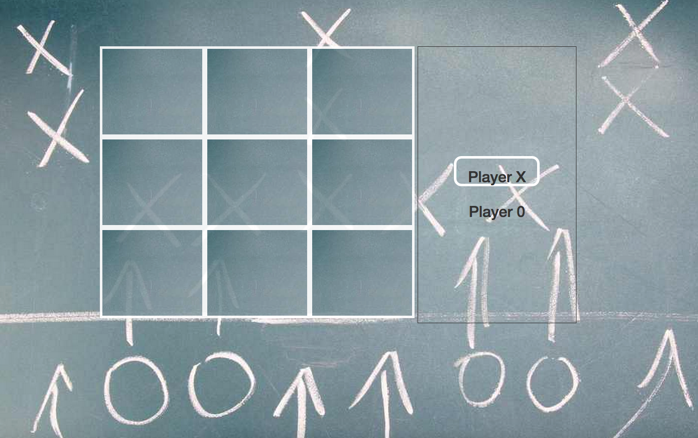
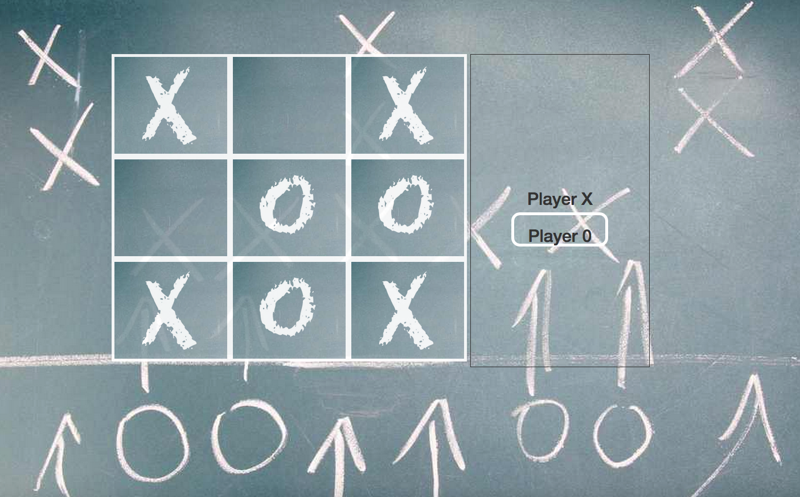

<h1>Tic-Tac-Toe</h1>

<h3>Description:</h3>

Working in a team of 2, divide up work to build a fully functional Tic-Tac-Toe Game using:

- Javascript
- jQuery 
- HTML
- CSS

<h3>Features:</h3>

Game Area

- 3x3 board
- Dynamically generated using Javascript/jQuery
- 2 player indicators
- One highlights to indicate a player's turn
- Mark each square alternately
- X then O, then back to X, etc
- Squares cannot be re-clicked once set

End of game

- Game will check each turn after the 5th turn to see if there is a winner (5 turns minimum needed for there to be a winner)
- If there is a winner, game will stop and alert the user who won
- If there is no winner at the end, an alert will let you know it was a tie
- If there is a  winner, or if there is a tie, you will be asked if you'd like to play again.  If you do, the game board will reset.  If you don't, the game board will stay as it was at the end of the game.  

<h3>Things I learned during this project</h3>
- Work delegation with a team member.  Making sure we know our part of the project and that our individual parts will work well together.  
- Checking conditions to see if there is a winner, or who's turn it is.  Finding a winner was more difficult than I imagined until we worked out the logic together.  
- I loved learning how to dynamically create content for the page.  
